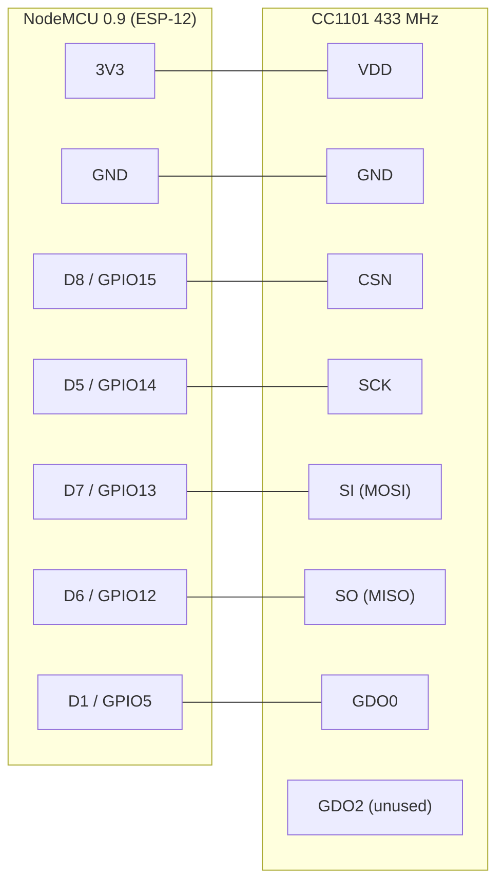

# everblu-meters

Read your water meter from Home Assistant. An ESP8266 and a 433 MHz radio
interrogate an **Itron EverBlu Cyble Enhanced** meter over the RADIAN protocol
once a day, and publish the index over MQTT.

> [!WARNING]
> **This fork does not currently read a meter.** The radio library was rewritten
> from scratch and there is an open bug in ESP↔meter communication. Everything
> below is accurate, but expect to debug. Help welcome.

Based on [lamaisonsimon's
wiki](http://www.lamaisonsimon.fr/wiki/doku.php?id=maison2:compteur_d_eau:compteur_d_eau)
and [psykokwak-com/everblu-meters-esp8266](https://github.com/psykokwak-com/everblu-meters-esp8266).

## What you need

- A **NodeMCU 0.9** (ESP-12) — other ESP8266 boards work, see [Wiring](#wiring).
- A **CC1101 433 MHz** module.
- ~17.3 cm of wire for an antenna, or a 433 MHz antenna.
- An MQTT broker, and Home Assistant if you want the entities.
- Your meter's **year** and **serial**, read off its label (see `meter_label.png`).

## Wiring

Seven wires. Match the CC1101 pins by the **label silkscreened on your board**,
not by position — pin order differs between the generic 8-pin modules and the
E07-M1101D, and both are sold as "CC1101 433MHz".

| CC1101 | NodeMCU | GPIO | |
| --- | --- | --- | --- |
| VDD | `3V3` | — | **3.3 V only** |
| GND | `GND` | — | |
| CSN | `D8` | 15 | fixed |
| SCK | `D5` | 14 | fixed |
| SI (MOSI) | `D7` | 13 | fixed |
| SO (MISO) | `D6` | 12 | fixed |
| GDO0 | `D1` | 5 | configurable |
| GDO2 | — | — | leave unconnected |



The four SPI lines are the ESP8266's hardware SPI peripheral and cannot be
moved. Only GDO0 is a choice. The SPI clock is 500 kHz, so dupont jumpers are
fine.

> [!CAUTION]
> Power the module from **`3V3`, never `VIN`**. The CC1101 is not 5 V tolerant
> (3.9 V absolute maximum) and `VIN` sits right beside `3V3` on the header.

> [!IMPORTANT]
> **Fit the antenna before powering up.** A quarter wave at 433 MHz is ~17.3 cm
> of wire. Without one, range is centimetres and the frequency sweep silently
> finds nothing — which looks exactly like a software bug.

<details>
<summary>Using a different GDO0 pin</summary>

`D1` (GPIO5) is the default, so wiring to it needs no code change. `D2` (GPIO4)
is the only other safe pin. Avoid the rest:

- `D0` / GPIO16 — no internal pull-up, and the driver needs one.
- `D3` / GPIO0, `D4` / GPIO2 — boot straps, must be HIGH at reset. `D4` is also the onboard LED.
- `D8` / GPIO15 — boot strap, must be LOW at reset; already CSN.
- `TX` / `RX` — the serial console, used heavily for logging.
- GPIO6–11 — wired to the flash chip.

</details>

## Build & flash

Uses [PlatformIO](https://platformio.org/). All configuration lives in two
gitignored files, so no tracked source needs a local edit and your WiFi password
cannot ride along in a commit:

```sh
cp include/secrets.h.example include/secrets.h
cp platformio_local.ini.example platformio_local.ini
```

Fill in `include/secrets.h` — WiFi, MQTT broker, NTP server, POSIX timezone, and
the meter's year and serial off its label (see `meter_label.png`).

> [!WARNING]
> **Drop any leading zero from the serial.** `0123456` is an *octal* literal in
> C — it silently becomes 42798, and a serial containing an 8 or 9 will not
> compile at all. Write `123456`.

`TZ_STRING` is a [POSIX TZ
string](https://www.gnu.org/software/libc/manual/html_node/TZ-Variable.html),
not an IANA name — it defaults to Europe/Brussels. Note the sign is inverted:
`CET-1` means UTC**+**1. Find yours in the `TZ` column of [this
list](https://github.com/nayarsystems/posix_tz_db/blob/master/zones.csv).

Then:

```sh
pio run -t upload      # build and flash over USB
pio device monitor     # 115200 baud
pio test -e native     # optional: run the desktop tests
```

`platformio.ini` targets `board = nodemcu`, which is the NodeMCU **0.9**. For a
NodeMCU 1.0 (ESP-12E) change it to `nodemcuv2`; the pinout above is unchanged.

### Which firmware is running

Every build stamps itself from git, so there is nothing to remember to bump:

```
r46.1b09187            46th commit, built from 1b09187, working tree clean
r46.1b09187+a7dcc5f    the same commit, plus uncommitted changes
```

It appears in three places: the first serial line at boot, the `Log mirroring
started` line in the MQTT log, and **Firmware** on the Home Assistant device
page.

A `+` means the image was built from a working tree that no commit describes —
the usual case while debugging. The suffix fingerprints those changes, so two
different dirty builds are never confused, and rebuilding identical source
twice gives the same version. Without a `+`, the version identifies the source
exactly.

Generated into `include/version.h` by `scripts/version.py` before each build,
from `src/`, `include/` and `platformio.ini`. Editing anything else — notes,
datasheets, editor settings — deliberately leaves the version alone.

### Updating over WiFi

Once a USB-flashed image is running, later updates go over the network:

```sh
pio run -e esp8266_ota -t upload
```

Set `OTA_PASSWORD` in `include/secrets.h` and the matching `--auth=` in
`platformio_local.ini` — they are two programs authenticating to each other, so
the password has to appear in both. If they disagree you get *Authentication
Failed*.

`upload_port` defaults to `everblu-cyble.local`, which is `MQTT_CLIENT_NAME`
doing double duty as the mDNS hostname. If mDNS is unreliable on your network,
put the device's IP address there instead.

> [!IMPORTANT]
> **Set an OTA password.** Anything on your LAN can reach the update port. Leave
> it empty and `EspMQTTClient` silently reuses your *MQTT* password instead,
> which is worse than no password because nothing says so.

> [!NOTE]
> OTA cannot install itself and cannot repair a bad image — the first flash and
> any recovery need the cable. Updates work during a frequency sweep; the radio
> is parked before the reboot so it cannot be left transmitting. See
> [ADR-0004](docs/adr/0004-ota-is-pushed-over-the-lan-not-orchestrated-by-home-assistant.md)
> for why updates do not go through Home Assistant.

## First run

The reader does not yet know which frequency reaches your meter, so it must
search for it once:

1. Wait for the device to connect to WiFi and MQTT, and for NTP to set the clock.
2. Press **Full Sweep** in Home Assistant, during the meter's waking hours
   (Mon–Sat, 06:00–18:00).
3. The sweep takes minutes of continuous transmission. The frequency it finds is
   saved to EEPROM and reused from then on.

From then on the meter is read **once a day at 12:00 local time** by default.

## Home Assistant

Entities appear automatically under one *Everblu Cyble* device:

| Entity | Topic | Purpose |
| --- | --- | --- |
| Reading Time | `everblu/cyble/schedule/time/set` | Daily reading time as `HH:MM`. Persisted. |
| Read Now | `everblu/cyble/command/read` | Read immediately on the known frequency. |
| Full Sweep | `everblu/cyble/command/sweep` | Forget the frequency and search again. |
| Check Wiring | `everblu/cyble/command/wiring` | Re-run the wiring check without a reboot. |
| Status | `everblu/cyble/status` | See below |
| Last Read | `everblu/cyble/last_read` | When the meter last answered, ISO 8601 UTC. |
| CC1101 Wiring | `everblu/cyble/wiring` | `ok`, `spi_failed`, `gdo0_failed` |

Readings are published retained on `everblu/cyble/index`, `.../battery` and
`.../readings`.

Status is one of:

| Value | Meaning |
| --- | --- |
| `ok` | A read completed and the values above were updated. |
| `reading` | A read is in flight. |
| `sweeping` | A full frequency sweep is in flight. |
| `busy` | A request arrived while the radio was already in use. |
| `asleep` | Asked to read outside the meter's wakeup window. |
| `no_response` | The meter did not answer on any frequency tried. |
| `not_provisioned` | As above, and no frequency has ever been found. |
| `gave_up` | The day's attempt budget is spent; waiting for tomorrow. |
| `no_clock` | Asked to transmit before NTP had set the clock. |

The scheduled read is attempted at most **5 times a day**. Each failure costs a
full sweep of transmission, so rather than retrying until the wakeup window
shuts, the reader gives up and waits for the next day. **Last Read** is what
tells you whether it is still working — the index alone cannot, since a stalled
index looks exactly like a closed tap.

Every entity is tied to `everblu/cyble/availability`, so they grey out when the
device stops answering — including while it reboots into a new image, and
permanently if it never comes back. Status alone cannot tell you this: it is
retained, so a dead device goes on reporting whatever it last managed to say.

The firmware version appears on the device page as **Firmware**, so you can
check what is actually running without opening a serial console.

> [!NOTE]
> Status reports the operation that was *requested*, not the one running. A
> daily read that falls back to a full sweep — because the meter has moved off
> its stored frequency — still shows `reading` for the several minutes that
> sweep takes.

## Troubleshooting

### Logs

Everything on the serial console is mirrored to `everblu/cyble/log`, one line
per message, each stamped with the local time the event occurred:

```sh
mosquitto_sub -h myMqttServer -t 'everblu/cyble/log' -v
```

This topic is **not retained** — the broker keeps no copy, so you only see lines
that arrive while you are subscribed. The device is silent between readings, so
an idle MQTT Explorer will show nothing at all. Press **Read Now** to produce
traffic. It is also not exposed as a Home Assistant entity: far too chatty for
the recorder.

Lines logged before MQTT connects stay on serial only; `Log mirroring started`
marks the boundary.

### Recent history

Reads happen once a day and failures are easy to miss, so the last few lines are
also published, joined together and **retained**, on:

    everblu/cyble/log/recent

Because it is retained, the broker holds a copy: open MQTT Explorer at any time
and recent history is already there, with no subscription timing to get right
and nothing to configure in Home Assistant.

It holds roughly the last 24 lines, capped at 900 bytes, and is refreshed
whenever something new is logged. That is enough to cover a whole read, and the
tail of a sweep.

> [!NOTE]
> The snapshot lives in RAM, so it is empty after a reboot and fills up again as
> the device logs. For unlimited history that survives reboots, subscribe to the
> live topic and append it to a file:
>
>     mosquitto_sub -h myMqttServer -t everblu/cyble/log >> everblu.log

### Reading the log

Timestamps come from the device and record when the event happened, not when it
was published — lines are queued and sent from the main loop, so they can arrive
seconds late. Before NTP has set the clock they read `boot+12.345`, seconds
since power-on.

> [!WARNING]
> **The log has gaps by design.** It is published at QoS 0 — the underlying
> `PubSubClient` supports nothing else — so anything logged while the broker
> connection is down is lost rather than queued, and anything logged before MQTT
> connects stays on serial. The retained snapshot recovers some of this, since
> it is republished in full on every reconnect, but if you are chasing a fault
> that takes WiFi or the broker down with it, keep a serial cable attached. This
> is a convenience, not a flight recorder.

**Status is `asleep`.** The meter is deaf outside **Mon–Sat, 06:00–18:00**, and
the reader will not transmit then. Nothing is wrong.

**Status is `no_clock`.** NTP has not synchronised yet. The waking-hours check
needs the time, so the reader refuses to transmit until it has it.

**Status is `no_response`.** The meter did not answer on any frequency tried.
Check the antenna first, then the wiring, then that the year and serial match
the label.

**A scheduled reading was missed.** Readings are tracked by date, not by a
countdown — if the device was offline at 12:00 it retries later the same day,
and stops once that day has been read.
