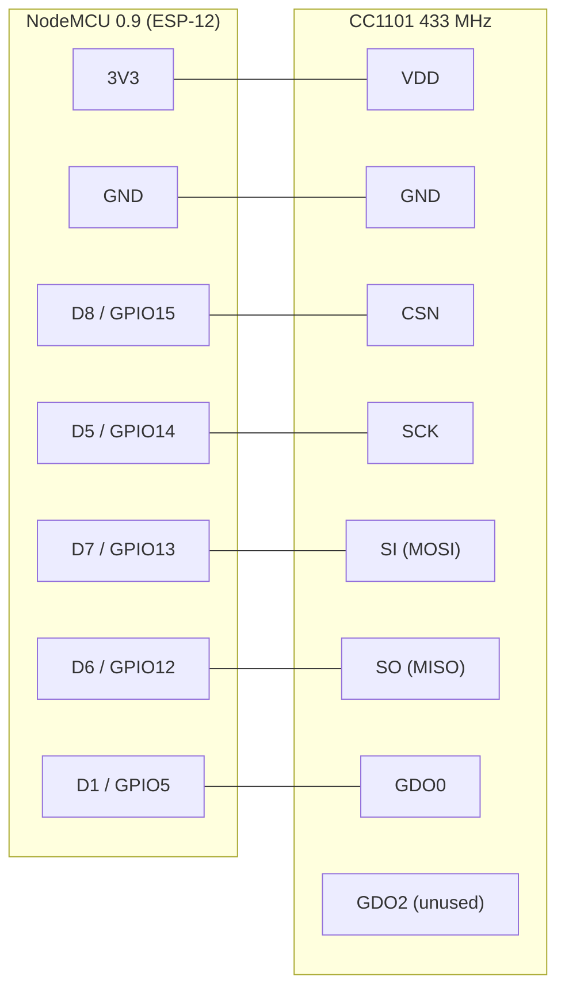

# everblu-meters

Read your water meter from Home Assistant. An ESP8266 and a 433 MHz radio
interrogate an **Itron EverBlu Cyble Enhanced** meter over the RADIAN protocol
once a day, and publish the index over MQTT.

> [!WARNING]
> **This fork does not currently read a meter.** The radio library was rewritten
> from scratch and there is an open bug in ESP↔meter communication. Everything
> below is accurate, but expect to debug. Help welcome.

Based on [lamaisonsimon's
wiki](http://www.lamaisonsimon.fr/wiki/doku.php?id=maison2:compteur_d_eau:compteur_d_eau)
and [psykokwak-com/everblu-meters-esp8266](https://github.com/psykokwak-com/everblu-meters-esp8266).

## What you need

- A **NodeMCU 0.9** (ESP-12) — other ESP8266 boards work, see [Wiring](#wiring).
- A **CC1101 433 MHz** module.
- ~17.3 cm of wire for an antenna, or a 433 MHz antenna.
- An MQTT broker, and Home Assistant if you want the entities.
- Your meter's **year** and **serial**, read off its label (see `meter_label.png`).

## Wiring

Seven wires. Match the CC1101 pins by the **label silkscreened on your board**,
not by position — pin order differs between the generic 8-pin modules and the
E07-M1101D, and both are sold as "CC1101 433MHz".

| CC1101 | NodeMCU | GPIO | |
| --- | --- | --- | --- |
| VDD | `3V3` | — | **3.3 V only** |
| GND | `GND` | — | |
| CSN | `D8` | 15 | fixed |
| SCK | `D5` | 14 | fixed |
| SI (MOSI) | `D7` | 13 | fixed |
| SO (MISO) | `D6` | 12 | fixed |
| GDO0 | `D1` | 5 | configurable |
| GDO2 | — | — | leave unconnected |



The four SPI lines are the ESP8266's hardware SPI peripheral and cannot be
moved. Only GDO0 is a choice. The SPI clock is 500 kHz, so dupont jumpers are
fine.

> [!CAUTION]
> Power the module from **`3V3`, never `VIN`**. The CC1101 is not 5 V tolerant
> (3.9 V absolute maximum) and `VIN` sits right beside `3V3` on the header.

> [!IMPORTANT]
> **Fit the antenna before powering up.** A quarter wave at 433 MHz is ~17.3 cm
> of wire. Without one, range is centimetres and the frequency scan silently
> finds nothing — which looks exactly like a software bug.

<details>
<summary>Using a different GDO0 pin</summary>

`D1` (GPIO5) is the default, so wiring to it needs no code change. `D2` (GPIO4)
is the only other safe pin. Avoid the rest:

- `D0` / GPIO16 — no internal pull-up, and the driver needs one.
- `D3` / GPIO0, `D4` / GPIO2 — boot straps, must be HIGH at reset. `D4` is also the onboard LED.
- `D8` / GPIO15 — boot strap, must be LOW at reset; already CSN.
- `TX` / `RX` — the serial console, used heavily for logging.
- GPIO6–11 — wired to the flash chip.

</details>

## Build & flash

Uses [PlatformIO](https://platformio.org/). Edit
`src/everblu-meters-esp8266.ino` first:

```c
const char *NtpServer = "myNtpServer";
const char *TZstr = "CET-1CEST,M3.5.0,M10.5.0/3"; // Europe/Brussels

#define METER_YEAR 20       // Two-digit year from the meter label
#define METER_SERIAL 123456 // Serial, WITHOUT any leading zero
#define GDO0_PIN 5          // Leave at 5 if you wired GDO0 to D1

EspMQTTClient mqtt(
  "WifiSSID",
  "WifiPassword",
  "myMqttServer",   // MQTT broker
  "MQTTUsername",   // Omit if not needed
  "MQTTPassword",   // Omit if not needed
  "TestClient"      // Unique client name
);
```

> [!WARNING]
> **Drop any leading zero from the serial.** `0123456` is an *octal* literal in
> C — it silently becomes 42798, and a serial containing an 8 or 9 will not
> compile at all. Write `123456`.

`TZstr` is a [POSIX TZ
string](https://www.gnu.org/software/libc/manual/html_node/TZ-Variable.html),
not an IANA name — it defaults to Europe/Brussels. Note the sign is inverted:
`CET-1` means UTC**+**1. Find yours in the `TZ` column of [this
list](https://github.com/nayarsystems/posix_tz_db/blob/master/zones.csv).

Then:

```sh
pio run -t upload      # build and flash
pio device monitor     # 115200 baud
pio test -e native     # optional: run the desktop tests
```

`platformio.ini` targets `board = nodemcu`, which is the NodeMCU **0.9**. For a
NodeMCU 1.0 (ESP-12E) change it to `nodemcuv2`; the pinout above is unchanged.

## First run

The reader does not yet know which frequency reaches your meter, so it must
search for it once:

1. Wait for the device to connect to WiFi and MQTT, and for NTP to set the clock.
2. Press **Full Scan** in Home Assistant, during the meter's waking hours
   (Mon–Sat, 06:00–18:00).
3. The scan takes minutes of continuous transmission. The frequency it finds is
   saved to EEPROM and reused from then on.

From then on the meter is read **once a day at 12:00 local time** by default.

## Home Assistant

Entities appear automatically under one *Everblu Cyble* device:

| Entity | Topic | Purpose |
| --- | --- | --- |
| Reading Time | `everblu/cyble/schedule/time/set` | Daily reading time as `HH:MM`. Persisted. |
| Read Now | `everblu/cyble/command/read` | Read immediately on the known frequency. |
| Full Scan | `everblu/cyble/command/scan` | Forget the frequency and search again. |
| Status | `everblu/cyble/status` | `ok`, `reading`, `sweeping`, `asleep`, `no_response`, `not_provisioned`, `no_clock` |

Readings are published retained on `everblu/cyble/liters`, `.../battery` and
`.../num_readings`.

## Troubleshooting

**Watch the logs without a serial cable.** Everything on the serial console is
mirrored to `everblu/cyble/log`:

```sh
mosquitto_sub -h myMqttServer -t 'everblu/cyble/log' -v
```

This is not exposed as a Home Assistant entity — it is far too chatty for the
recorder. Anything logged before the broker connects stays on serial only.

**Status is `asleep`.** The meter is deaf outside **Mon–Sat, 06:00–18:00**, and
the reader will not transmit then. Nothing is wrong.

**Status is `no_clock`.** NTP has not synchronised yet. The waking-hours check
needs the time, so the reader refuses to transmit until it has it.

**Status is `no_response`.** The meter did not answer on any frequency tried.
Check the antenna first, then the wiring, then that the year and serial match
the label.

**A scheduled reading was missed.** Readings are tracked by date, not by a
countdown — if the device was offline at 12:00 it retries later the same day,
and stops once that day has been read.
