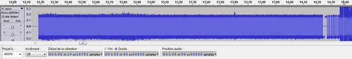
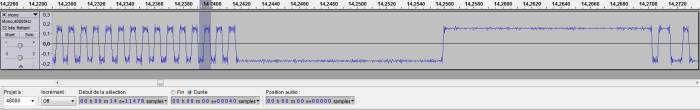
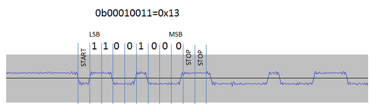
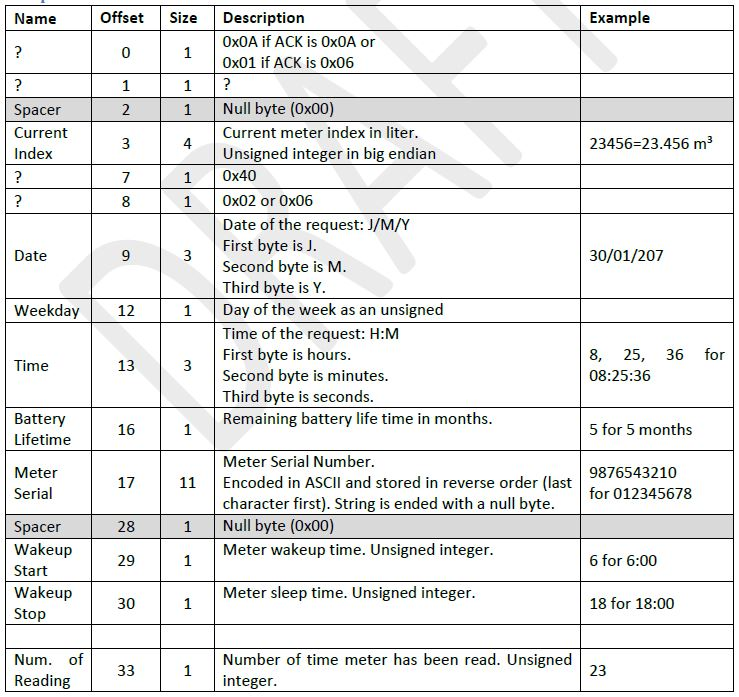
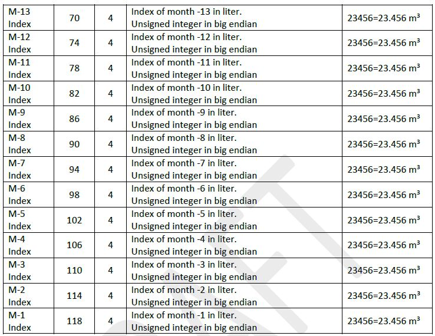
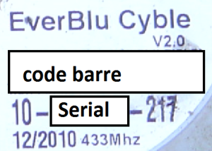

# Cyble RF 433 MHz — the Maison Simon wiki

> **Translated transcription.** This is an English rendering of the French
> DokuWiki page *Cyble RF 433Mhz installé par ma communauté de commune* from
> [lamaisonsimon.fr](http://www.lamaisonsimon.fr/wiki/doku.php?id=maison2:compteur_d_eau:compteur_d_eau),
> captured by web.archive.org on 2025-03-21 and archived in this repository as
> `maison2_compteur_d_eau_compteur_d_eau [Le WIKI de la Maison Simon].htm`.
>
> This is the source cited by [ADR-0002](../adr/0002-sweep-is-crystal-calibration-not-meter-discovery.md).
> Where a protocol claim matters, check it against the original HTML — prose was
> translated, but every register value, hex dump, table and code block is
> reproduced verbatim. The page's 135 reader comments are not included.

The Actaris radio-frequency module for water meters: a reliable, compact and
intelligent tool for remote meter reading, from the distribution network to
multi-occupancy housing. A compact, fully watertight RADIAN™-compatible radio
communication module, Cyble RF installs very easily, on site or at the factory,
on cold-water and hot-water meters alike. Fitting it on site requires no
cabling, no wall mounting, and neither removal nor unsealing of the meter.
Specifically designed to withstand harsh environments, Cyble RF suits every
condition encountered, from a flooded meter pit to a service duct. Beyond the
index reading, its many intelligent functions provide:

- 13 months of monthly index history
- backflow detection, cumulative reverse volume, and 13 months of monthly history
- leak detection and 13 months of monthly history
- tamper-attempt detection
- end-of-battery-life indication
- assorted alarms

## The RADIAN protocol

- Impossible to find on the internet; the address <http://www.radianprotocol.com/> is no longer live.

### From web.archive.org

**The Radian Protocol — a two-way 433 MHz radio protocol**

Radian Protocol is designed for all applications in water, electricity, gas and
heat meter reading and data transmitting. Its two-way characteristics allow
developed service solutions, including information exchange with the final user.

- **Reliability**
  - physical layer: FSK modulation, narrow band
  - Logical Link Layer: packet numbering
- **Two-way, half duplex, data transmission**
- **Relaying capability**
  - receive and repeat datagrams
  - up to 7 nodes forward
- **Sophisticated wake-up mechanism**
  - standby mode
  - wake-up signal ⇒ awakened mode
  - my address? yes ⇒ let's communicate! / no ⇒ back to standby
- Time to get data from a node: 2–3 s
- Both master-slave control and CSMA asynchronous communications

### From the documentation of a meter-reading tool

- FSK method, bidirectional
- Frequency 433.82 MHz
- FSK modulation, asynchronous NRZ
- Radian protocol
- Modulation offset (deviation) 5 kHz
- Channel bandwidth 25 kHz
- Transmission rate 2400 baud
- Transmit power of the central radio transmitter +10 dBm (10 mW)
- Receive sensitivity −105 dBm
- Range approx. 50 m

`f5943_cyblerfvacatris.pdf` adds nothing further.

### Other leads

- Standard 13757-4 — meh, the protocol does not really line up in the end.
- `open-meter_wp2_d2.1_part3_v1.0.pdf` → EverBlu (5.4.11) 10 kbps → false lead.
- Cyble RF technical dossier:
  - the carrier is 433.82 MHz
  - they talk about cryptography (apart from the CRC, there is nothing…)
  - the meter can only be woken during its "business hours" (true, but the hours
    and days are factory-configurable)

## Hacking — how this was worked out

In 2011 I threw this web page to the wind of the web.

In 2014 Julien latched on; we pooled the few documents we each had on the subject.

He decided to listen to his housing estate's meters 24/7 with an SDR and a big
hard disk.

In February 2016 he managed to capture several meter readings, and we started
scratching away at them.

But we were still missing how to compute the CRC, and how to connect what is
printed on our meter to the reading frame.

SigmaPic joined the project and laid a good deal of it out flat (mostly the bits).

That left the label problem.

In December 2016 we were all sniffing our meters, and Julien managed to capture
the reading of his own meter.

A month later SigmaPic managed to read his own meter.

## Protocol

### Physical layer

#### RF transmission

- FSK method, bidirectional
- Frequency 433.82 MHz
- FSK modulation, asynchronous NRZ
- Radian protocol
- Modulation offset (deviation) 5 kHz
- Channel bandwidth 25 kHz
- Transmission rate 2400 baud

#### Communication frame

Any communication frame consists in:

- A preamble used to notify the receiver that data will be sent
- A sync word used to notify the receiver that data transmission is starting
- Some data

##### Preamble

Preamble is a series of 0101….0101 at 2400 bits/sec. There are two preamble
durations:

- Long preamble for meter wake-up: 4928 bits (2464 × 01)
- Short preamble for other frames: 80 bits (40 × 01)

In order to save energy, the meter wakes up every 2 seconds and checks if
someone is speaking. If nobody is speaking, the meter goes back to sleep. This
is the reason why a long preamble is used when the master sends a request.


*A preamble with a master request*


*Zoom on the end of the preamble*

##### Sync pattern

Sync pattern starts with a low level during 14.3 ms followed by a high level
during 14.3 ms.

> The wiki shows an image here captioned *"preamble and synch pattern of meter
> response"* (`wpu_synch_meter.jpg`). It was not captured by the archive crawl
> and is not available.

##### Data

Data are sent by UART:

- Baudrate: 2400 bits/sec
- LSB first
- 1 start bit / no parity / 2 or 2.5 stop bits



### Frame structure

| L(1) | C(1) | S(1) | Receiver Address(5) | S(1) | Sender Address(5) | S(1) | Data + Checksum (4-240) |
|---|---|---|---|---|---|---|---|

- L (Length Byte) Total number of bytes including length byte and checksum
- C (Control Byte)
  - 0x10: Request
  - 0x06: Acknowledge
  - 0x11: Response
- S (Spacer) 0x00
- Receiver Address (5 bytes): meter address when master is speaking, master address when meter is speaking
- S (Spacer) 0x00
- Sender Address (5 bytes): master address when master is speaking, meter address when meter is speaking
- Data Payload (up to 238 bytes)
- Checksum (2 bytes) CRC-CCITT ([Kermit](https://www.lammertbies.nl/comm/info/crc-calculation.html))
  - Polynomial: 0x8408
  - Initial value: 0
  - Bytes are reversed (MSB first)
  - Result is inverted
  - Final XOR: 0
  - Stored in little endian

#### Meter data mapping





#### Meter address encoding

- Address is encoded over 5 bytes.
- First byte is 0x45 (to be confirmed).
- The four other bytes are deduced from the numbers below the bar-code.
- Format is YY-AAAAAAA-CCC.
  - 2nd byte YY: year encoded on 8 bits
  - 3rd to 5th byte AAAAAAA: to be converted from decimal to hex, MSB first
  - CCC: check digits (not used in address encoding, but used to verify
    YY-AAAAAAA consistency)



### Example

- Serial number 16-0123456-CCC
- YY = 16d → 10h
- AAAAAAA = 0123456d → 01E240h
- Master request to be preceded by 2 s of 2464 × 01, then followed by the sync
  pattern, **and encapsulated in 1 start bit / no parity / 2.5 stop bits (works
  also with 2 bit and 3 bit)**
  - `13 10 00 45 10 01 E2 40 00 45 67 89 AB CD 00 0A 40 DA DC (cks)` — to compute
    the checksum, take the Kermit row and swap the nibbles ⇒
    <http://crccalc.com/?crc=131000451001E24000456789ABCD000A40&method=crc16&datatype=hex>

|  | Length | Control | Spacer | Receiver Address | Spacer | Sender Address | Spacer | Data + Checksum |
|---|---|---|---|---|---|---|---|---|
| Master request | 13 | 10 | 00 | 45 10 01 E2 40 | 00 | 45 67 89 AB CD | 00 | 0A 40 DA DC |
| Meter ack | 12 | 06 | 00 | 45 67 89 AB CD | 00 | 45 10 01 E2 40 | 00 | 0A 90 9E |
| Meter response | 7C | 11 | 00 | 45 67 89 AB CD | 00 | 45 10 01 E2 40 | 00 | 01 08 00 D2 73 07 00 40 ….. cks (488402 litres) |
| Master ack | 12 | 06 | 00 | 45 10 01 E2 40 | 00 | 45 67 89 AB CD | 00 | 0A 23 93 |

## Meter-reading solutions

### CC1101

The CC1101 is an RF transceiver with a great many settable parameters, but the
real frequency is not exactly the one you set.

```c
//par exemple j'ai 2 carte CC101 pour un même réglage de fréquence un montage obtient une réponse l'autre non
halRfWriteReg(FREQ0,0xC1); //Frequency Control Word, Low Byte CC1101_N1 814 824 (KO) ; CC1101_N2 810 820 (OK)
halRfWriteReg(FREQ0,0xB7);   //CC1101_N1 810 819.5 OK
mon compteur aussi fait F1 : 433808500  F2 : 433819500
```

*(Translation of the comments above: "for example I have 2 CC1101 boards — with
the same frequency setting one gets a response and the other does not"; and "my
meter also does F1: 433808500, F2: 433819500".)*

Hence the need to calibrate the FREQ0 register using a DVB-T dongle acting as an
SDR. *(The wiki shows an SDR screenshot here; it was not captured by the archive
crawl.)*

### Raspberry Pi + CC1101

#### Wiring diagram

```text
5V,GND ---> RPi HE26 ---.-----2*GND; 2*3.3V , SCLK ,MISO , MOSI , CSn, GDO2, GDO0 -------->  CC1101 HE10
                        |
                      debug_connector(HE14)
```

##### RPi pin allocation

WiringPi Pin = WPP

| Function | WPP | Name | Pin | Pin | Name | WPP | Function |
|---|---|---|---|---|---|---|---|
|  |  | 3.3v | 1 | 2 | 5v |  |  |
|  | 8 | SDA | 3 | 4 | 5v |  |  |
|  | 9 | SCL | 5 | 6 | 0v |  |  |
|  | 7 | GPIO7 | 7 | 8 | TxD | 15 |  |
|  |  | 0v | 9 | 10 | RxD | 16 |  |
| GDO0 | 0 | GPIO0 | 11 | 12 | GPIO1 | 1 |  |
| GDO2 | 2 | GPIO2 | 13 | 14 | 0v |  |  |
| LED | 3 | GPIO3 | 15 | 16 | GPIO4 | 4 |  |
|  |  | 3.3v | 17 | 18 | GPIO5 | 5 |  |
| MOSI | 12 | MOSI | 19 | 20 | 0v |  |  |
| MISO | 13 | MISO | 21 | 22 | GPIO6 | 6 |  |
| SCLK | 14 | SCLK | 23 | 24 | CE0 | 10 | CSn |
| GND |  | 0v | 25 | 26 | CE1 | 11 |  |

```c
#define GDO2 2 //header  13
#define GDO1_MISO 13
#define GDO0 0 //header  11
#define MOSI 12
#define cc1101_CSn 10 ////header  24
#define LED  3 //header 15
```

##### HE10 CC1101

Top view

| Function | Header | Header | Function |
|---|---|---|---|
| 3.3v | 1 | 2 | 3.3V |
| MOSI | 3 | 4 | SCLK |
| MISO | 5 | 6 | GDO2 |
| CSn | 7 | 8 | GDO0 |
| GND | 9 | 10 | GND |

Flipped view from bottom

| Function | Header | Header | Function |
|---|---|---|---|
| 3.3v | 2 | 1 | 3.3V |
| MOSI | 4 | 3 | SCLK |
| MISO | 6 | 5 | GDO2 |
| CSn | 8 | 7 | GDO0 |
| GND | 10 | 9 | GND |

##### Debug connector (HE14)

SALEAE led(1)

| Function | Header | Header | Function |
|---|---|---|---|
| D1 | 1 | 2 | D2 |
| D3 | 3 | 4 | D4 |
| D5 | 5 | 6 | D6 |
| D7 | 7 | 8 | D8 |
| GND | 9 | 10 | GND |

```text
           DB9 TDA (face
(GND) 5    4    3    2   1 (data)
         9    8    7   6(5v)
```

HE14

| Function | Header | Header | Function |
|---|---|---|---|
| (D1 saleae) DATA TDA | 1 | 2 | (D2 saleae) LED |
| (D3 saleae) SCLK | 3 | 4 | (D4 saleae) SI |
| (D5 saleae) GDO2 | 5 | 6 | (D6 saleae) SO |
| (D7 saleae) GDO0 | 7 | 8 | (D8 saleae) CSn |
| GND | 9 | 10 | GND |
| 3.3 | 11 | 12 | GND |
| DATA TDA | 13 | 14 | 5V |

#### Code

The zip has a password: it is the name of the zip file. (`radian_trx.zip`,
archived at lamaisonsimon.fr.)

##### Configuration

The code as delivered will not compile
(`gcc radian_trx.c -o radian_trx -lwiringPi -lpthread -Wall`) because there are
2 parameters to adjust plus 2 typos:

- Frequency, to be adjusted to suit your CC1101 — `CC1101.c` line 229:
  `halRfWriteReg(FREQ0, ….)`
  - I advise starting with the base frequency, then measuring with the DVB-T
    dongle to centre it on 433.820, or on the meter's response.
  - If there was no response from the meter, you will have to try shifting in
    2 kHz steps either side of 433.820.
    - You modify FREQ0 by adding/subtracting a few units to shift the main
      frequency by 2 kHz. Bear in mind that a "€20 DVB-T SDR dongle" does not
      give the real frequency in absolute terms; in relative terms it is
      already better.
- The meter's serial number. Here is the line of code that goes with the example
  section:
  - `CC1101.c` line 664: `TS_len_u8=Make_Radian_Master_req(txbuffer, 16 , 123456 );`
- In `CC1101.c`, add `#define TX_LOOP_OUT 300` at the top.
- Delete a stray character `c` on line 5 of `radian_trc.c`.

#### Script

```sh
sudo crontab -e
55 9 * * *  sudo /home/pi/radian_trx/web_tx_releve >/dev/null 2>&1
55 9 * * *  sudo /home/pi/radian_trx/web_tx_releve >> /var/log/crontab.log
```

#### Performance

| Setup | Condition | Result |
|---|---|---|
| minepi + CC1101(2) + λ/4 behind partition wall | shutter open | rssi=185 lqi=128 F_est=255 |
| minepi + CC1101(2) + λ/4 inside partition wall | shutter open | rssi=185 lqi=128 F_est=255 |
| minepi + CC1101(2) + spiral antenna behind partition wall | shutter open | rssi=183-4 lqi=128 F_est=255 |

### Mbed + CC1101

*(Section empty in the source.)*

## RTL-SDR

- <https://www.youtube.com/watch?v=c3C7GBuxpNo>
- <http://www.nooelec.com/store/qs/>
  - Plug your NESDR into an available USB port
  - Open the 'NESDR Driver Installer', Zadig
  - Select 'List All Devices' from the 'Options' menu in Zadig
  - From the main dropdown, select the NESDR
  - Confirm the selected device has a USB ID of '0BDA 2838'
  - Press the big button to install drivers
- <http://m3ghe.blogspot.fr/p/adding-support-for-rtl-sdr-usb-dongles.html> ⇒ SDR console OK
- <http://www.rtl-sdr.com/rtl-sdr-quick-start-guide/>
- <http://rtl-sdr.sceners.org/?p=193> — kalibrate

At a sampling frequency of 31.25 ksps that is 2.5 GB of data over 12 h. It
sounds heavy, but on a 1 TB HDD it still lets you record 1024/2.5 = 410 working
days.

### Hardware

- <http://fr.farnell.com/mipot/32000508e/emetteur-fsk-50-pll-5-12v-433-92mhz/dp/1702924> — frequency range 433.42 MHz to 434.42 MHz
- <http://www.roue-libre.be/article.php3?id_article=180>
- <http://iw3hzx.altervista.org/Antenne/HENTENNA/Hentenna.htm>
- SDR
- SX1212
- <http://f5ad.free.fr/ANT-QSP_Descriptions_430.htm>
- <http://users.belgacom.net/hamradio/schemas/jpole.gif>
- <http://www.roue-libre.be/article.php3?id_article=258>
- <http://radio.pagesperso-orange.fr/Ant.htm#GP> ; <https://www.adri38.fr/antenne-ground-plane-446-mhz/>
- <https://www.elektor.nl/Uploads/Forum/Posts/How-to-make-a-Air-Cooled-433MHz-antenna.pdf>
- <http://www.qsl.net/ve2ztt/IndexD/moxon_fichiers/moxon.htm> ; <http://f1rzv.free.fr/moxon/index.php>

#### Antennas

<http://www.ta-formation.com/cours/e-antennes.pdf>

**Ranking**, per a modelisme.com forum thread on amplifying a 433 MHz UHF signal
and optimising reception — from lowest gain to highest:

- Half-wave monopole
- Quarter-wave monopole
- Half-wave dipole
- Quarter-wave dipole (approx. 70 Ω)
- Half-wave inverted-V antenna
- Quarter-wave inverted-V antenna
- Moxon antenna (approx. 50 Ω)
- Yagi, patch or quad antenna (directional)
